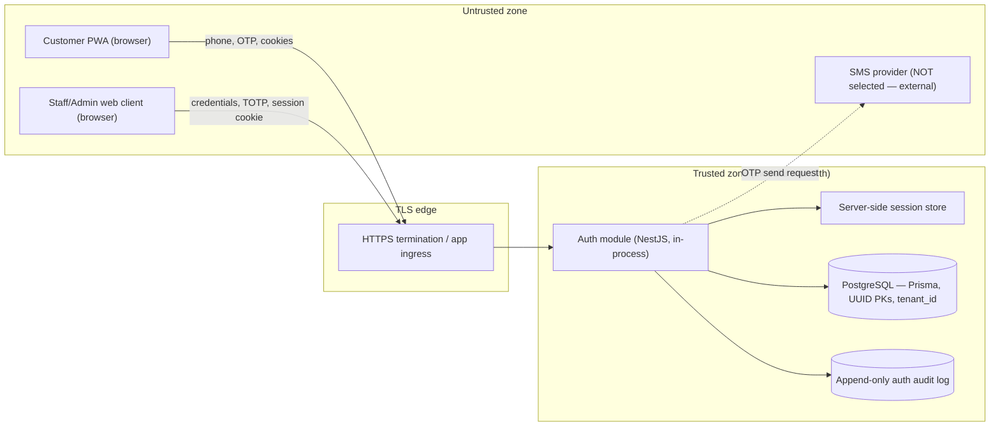

# Authentication Threat Model — Phase 1

<!--
  DOCUMENT TYPE: Pod B Security Artifact (Threat Model)
  VERSION: v0.5
  STATUS: Accepted by Kerem — BL-2 closed (PR #46 merge accepted as BL-2 closure, confirmed 2026-06-11). v0.5 records the Kerem-decided IR-25 closure (app-side SMS ceiling values + operational response-path owner = ADMIN, 2026-06-19; see §15); IR-24 (admin bootstrap procedure) remains the only open [NEEDS KEREM APPROVAL] item. Implementation remains blocked by BL-1/BL-3/BL-4/BL-5/BL-6. See §10, §13, §14, §15.
  AUTHOR: Pod B — Architecture, Logic & Risk
  REVIEWER: Pod B (self) + Kerem (subject-matter sensitivity: Authentication/
            authorization + Customer personal data handling + Security-sensitive)
  APPROVER: Kerem
  DATE: 2026-06-19
  CANONICAL REPO PATH: /docs/architecture/AUTH_THREAT_MODEL.md
  AUTHORITY: Derives from ADR-015 (Accepted). ADR-015 is authoritative; this
             document does NOT establish or change any decision. If this document
             and ADR-015 ever disagree, ADR-015 wins.
  RELATED DOCUMENTS:
    - /docs/adr/ADR-015-authentication-strategy.md (Accepted — authoritative source of the decision)
    - /docs/architecture/AUTHENTICATION_RECOMMENDATION_OQ-001.md (pre-ADR recommendation)
    - /docs/USER_ROLES_AND_PERMISSIONS.md (v0.2 — Pod A role/permission authority)
    - /docs/PROJECT_METHODOLOGY.md §20 (Security and KVKK Process), §11.1 (approval triggers), §12.3 (migration)
    - /docs/PROJECT_DECISION_INDEX.md (decision state)
    - /docs/ROLLBACK_POLICY.md (T-1/T-2 triggers; KVKK breach clock)
    - /docs/adr/ADR-004-orm-selection.md (Prisma; UUID PKs), /docs/adr/ADR-008 (shared schema + tenant_id)
  PR GATE NOTE: This is a documentation-only security artifact under ADR-009 §2 — it
                does not alter pod behavior, gates, decision state, methodology,
                templates, or platform instructions, so the ADR-009 §4 behavior-change
                gate does NOT fire (no Pod Impact Matrix / Instruction Update Packet
                required). Its subject matter touches Authentication/authorization,
                Customer personal data handling, and Security-sensitive controls; under
                ADR-009 §3 the strictest applicable trigger governs, so Pod B + Kerem
                review/approval is REQUIRED before merge. See §12.
  IMPLEMENTATION AUTHORITY: This document does NOT authorize Pod C work and does NOT
                create implementation issues. It enumerates requirements (§9) that must
                LATER become separately Pod B + Kerem approved Pod C issues.
-->

## 1. Purpose and Scope

This is the Pod B authentication threat model required by `ADR-015` (Implementation table)
and `PROJECT_METHODOLOGY.md` §20.1 before any authentication implementation is unblocked.
It is a security analysis of the Phase 1 authentication decision recorded in ADR-015. It
identifies threats, mitigations, residual risks, and implementation requirements per
authentication component.

**In scope (the components named for Phase 1):**

- `CUSTOMER` phone OTP (SMS) request and verification
- JWT access token (customer)
- Refresh token in `httpOnly` cookie (customer)
- `CASHIER` / `FB_STAFF` username/password server-side sessions
- `ADMIN` username/password + required TOTP MFA
- `ADMIN` step-up re-authentication for high-sensitivity actions
- Logout / session termination (all roles)
- Failed-login handling (all roles)
- Authentication audit logging
- Phone-number privacy across the authentication surface

**Out of scope (named here so the boundary is explicit):**

- SMS provider selection — **Not locked; blocked by the separate Pod B SMS provider
  report.** This document does **not** select a provider (see §8).
- Session table schema, Prisma models, token rotation implementation, password-hashing
  algorithm selection, RBAC enforcement pattern, MFA library selection — implementation
  detail for Pod C, reviewed by Pod B; not fixed here.
- Application authorization logic beyond authentication (the RBAC permission matrix is
  Pod A's `USER_ROLES_AND_PERMISSIONS.md` v0.2 authority).
- KVKK legal-basis determination (K-08 legal/privacy advisor) and the
  erasure-vs-append-only ledger tension (ADR-006/007 review).

**Synthetic data only.** All examples use synthetic references (`Customer A`,
`+90 555 000 00 01`, `cashier-01`). No real Adeks data appears anywhere in this document.

---

## 2. Methodology

Threats are enumerated per component using **STRIDE** (Spoofing, Tampering, Repudiation,
Information disclosure, Denial of service, Elevation of privilege) and the wallet/loyalty
abuse-case discipline mandated by `PROJECT_METHODOLOGY.md` §20.1. Each threat is rated:

- **Likelihood** and **Impact**: Low / Medium / High.
- **Residual risk** after the listed mitigation is applied: Low / Medium / High.

Mitigations that are already **binding** under ADR-015 are tagged `[ADR-015 §…]`. Mitigations
that are **new implementation requirements** surfaced by this threat model are tagged with an
implementation-requirement ID `[IR-xx]` and consolidated in §9. Residual risks that ADR-015
**explicitly accepts** are tagged `[ACCEPTED — ADR-015]` and are not reopened here.

---

## 3. Authentication Surface — Actors, Assets, Trust Boundaries

### 3.1 Actors

| Actor | Interface | Auth mechanism (ADR-015) |
|---|---|---|
| `CUSTOMER` | Customer PWA (mobile web) | Phone OTP → JWT access (~15 min) + refresh (~7–30 d) in `httpOnly` cookie |
| `CASHIER` | Web admin/cashier | Username/password → server-side session, 40-min inactivity timeout |
| `FB_STAFF` | Web admin/order | Username/password → server-side session, 40-min inactivity timeout |
| `ADMIN` | Web admin | Username/password + required TOTP MFA → server-side session, 15-min timeout, step-up re-auth |
| Unauthenticated visitor | Public PWA | None — public catalog/menu only (`USER_ROLES_AND_PERMISSIONS.md` §3) |
| External SMS provider | Outbound integration | **Not selected — blocked (§8)**; treated as an untrusted external dependency |

### 3.2 Assets to protect

- Customer phone numbers (primary PII anchor; `PROJECT_METHODOLOGY.md` §20.2).
- OTP codes in flight and the OTP delivery channel.
- JWT access tokens, refresh tokens, and the cookies carrying them.
- Staff/admin credentials (password hashes) and TOTP secrets.
- Server-side session state and session identifiers.
- The append-only authentication audit log.
- Role/identity integrity (no spoofing or escalation across `CUSTOMER` → staff → `ADMIN`).

### 3.3 Trust boundaries

Key boundaries: **(B1)** browser ↔ app ingress (all customer/staff traffic crosses an
untrusted network); **(B2)** app ↔ SMS provider (untrusted external processor handling PII);
**(B3)** application roles ↔ audit log (no role, including `ADMIN`, may write/edit/delete
audit entries — `ADR-015` Audit consequences). Inter-module calls inside the monolith are
in-process and require no token auth (`ADR-015` §4).

---

## 4. Customer Authentication — Phone OTP, JWT, Refresh Cookie

### 4.1 OTP request and delivery

| ID | STRIDE | Threat | L | I | Mitigation | Residual |
|---|---|---|---|---|---|---|
| T-C1 | I/D | Phone enumeration: attacker probes the OTP-request endpoint to learn which numbers are registered | M | M | Consistent user-facing response regardless of registration status `[ADR-015 §2]` | Low |
| T-C2 | D | SMS flooding / cost-abuse: attacker triggers mass OTP sends to a victim number or to inflate SMS spend | M | M | Rate-limit OTP requests by **IP and by phone number** `[ADR-015 §1]`; per-number send cap + cooldown `[IR-01]` | Low–Med |
| T-C2b | D | Distributed/low-and-slow abuse evades per-number limits and drives runaway SMS spend across many numbers | L–M | M | App-side **global send-volume ceiling** (send-count proxy for spend) with circuit-breaker, anomaly alerting on send-rate spikes, and an **`ADMIN`-owned** operational response path `[IR-25]`; values + response-path owner **decided (Kerem 2026-06-19) — see §15**; app-side controls, independent of provider selection | Low–Med |
| T-C3 | S | OTP brute force on the verify endpoint: attacker guesses the code | M | H | Verify-side attempt limit per OTP, short OTP TTL, sufficient code entropy, lock/expire OTP after N failures `[IR-02]` | Low |
| T-C4 | T/S | OTP replay / reuse: a captured or already-used code is replayed | L | H | OTP single-use; invalidated immediately on success or expiry; ephemeral — never persisted after verification `[ADR-015 KVKK §2]` `[IR-02]` | Low |
| T-C4b | I/T | OTP recoverable from temporary storage before verification (DB/cache/log) and used to bypass delivery | L | H | OTP must be short-lived and TTL-bound, single-use, and **not stored in recoverable plaintext before verification** (store a hash/derivation, not the raw code); discard on verify or TTL expiry `[IR-23]` | Low |
| T-C5 | I | OTP interception via SIM-swap / SS7 / malicious app | L–M | M | Out-of-band SMS limitation accepted for Phase 1 customer surface (no self-service balance mutation) `[ACCEPTED — ADR-015: SMS interception / SIM-swap]` | **Med (accepted)** |
| T-C6 | I | OTP or phone leaked into application/request logs | M | H | No phone number and no OTP in application logs `[ADR-015 §4]`; structured-logging redaction for phone/OTP/token fields `[IR-03]` | Low |
| T-C7 | R | Customer denies a login they performed | L | M | Successful-login audit event with customer UUID + timestamp (no raw phone) `[ADR-015 Audit]` `[IR-09]` | Low |

> **SMS-provider dependency.** Threats T-C2 and T-C5 also depend on controls owned by the
> SMS provider (delivery integrity, sender authentication, the provider's own abuse
> handling) and on the provider's status as a KVKK data processor. Those provider-side
> controls **cannot be assessed until a provider is selected** — see §8. `[NEEDS KEREM APPROVAL]`

### 4.2 JWT access token

| ID | STRIDE | Threat | L | I | Mitigation | Residual |
|---|---|---|---|---|---|---|
| T-C8 | T/E | Token forgery via algorithm confusion (`alg=none`, HS/RS confusion) | L | H | Pin signing algorithm server-side; reject `none`; validate `alg`, issuer, audience, expiry; managed signing-key storage + rotation plan `[IR-04]` | Low |
| T-C9 | I | Token exfiltration via XSS (if stored in JS-readable storage) | M | H | Tokens in `httpOnly` cookies; **never** `localStorage`/`sessionStorage` `[ADR-015 §3]`; `Secure` + `SameSite` + (recommended) `__Host-` prefix and tight `Path`/`Domain` `[IR-05]` | Low–Med |
| T-C10 | I | PII leakage through token claims | M | M | Claims carry **customer UUID only** — never phone number or other PII `[ADR-015 §4]` | Low |
| T-C11 | E | Customer token accepted on staff/admin endpoints (role confusion) | L | H | Token audience/role bound to customer surface; staff/admin auth is server-side session, not JWT — reject customer tokens on staff routes `[IR-06]` | Low |
| T-C12 | T | Replay of a stolen but unexpired access token | L–M | M | Short ~15-min access lifetime `[ADR-015 §1]`; bind sensitive flows to refresh/re-auth; TLS-only transport `[IR-07]` | Med |

### 4.3 Refresh token in `httpOnly` cookie

| ID | STRIDE | Threat | L | I | Mitigation | Residual |
|---|---|---|---|---|---|---|
| T-C13 | T/S | Stolen refresh token replayed for long-lived access | L–M | H | Refresh rotation on each use **with reuse detection** (a replayed rotated token revokes the family); or short-lived refresh + forced re-auth `[ADR-015 §5]` `[IR-08]` | Low–Med |
| T-C14 | S | Logged-out refresh token still usable | M | H | Explicit logout invalidates refresh token server-side (revocation list or short-lived + forced re-auth) — a logged-out token must not be reusable `[ADR-015 §5]` | Low |
| T-C15 | T | CSRF on cookie-borne auth for state-changing customer actions (order/reservation submission) | M | M | `SameSite` cookie attribute + anti-CSRF token on state-changing requests; reject cross-site form-initiated mutations `[IR-05]` | Low |
| T-C16 | I | Refresh lifetime exceeds the customer-data retention period | L | M | Refresh lifetime aligned to `DATA_RETENTION_POLICY.md` before go-live `[ADR-015 §1]` — **dependency, see §10 BL-3** | Med (until resolved) |

---

## 5. Staff Authentication — `CASHIER` / `FB_STAFF` Username/Password Sessions

| ID | STRIDE | Threat | L | I | Mitigation | Residual |
|---|---|---|---|---|---|---|
| T-S1 | S | Credential stuffing / password brute force on staff login | M | H | Memory-hard password hashing (Argon2id/bcrypt) `[ADR-015 §8]`; failed-login throttling + lockout/alert `[ADR-015 §7]` `[IR-10]`; generic error text (no username/password distinction) `[IR-11]` | Low–Med |
| T-S2 | E/R | Shared accounts break attribution of wallet/loyalty/payment actions | L | H | Individual accounts mandatory; shared accounts architecturally prohibited `[ADR-015 §2; locked audit principle]` | Low |
| T-S3 | S | Session fixation: attacker fixes a session ID then has staff authenticate into it | L | M | Regenerate session identifier on successful login; bind session to authentication event `[IR-12]` | Low |
| T-S4 | I | Session hijack via cookie theft on a shared terminal | M | M | `httpOnly`+`Secure`+`SameSite` session cookie `[IR-05]`; 40-min inactivity timeout `[ADR-015 §2]`; explicit shift-end logout in staff procedure (Pod A `CORE_USER_FLOWS.md`) | Med |
| T-S5 | D | Account-lockout abuse: attacker deliberately locks staff out, disrupting café operations | M | M | Progressive backoff + temporary lockout after repeated failures, with an admin/Kerem unlock path and alerting; **no indefinite hard lockout in Phase 1** unless Pod B later escalates a specific risk `[KEREM APPROVED 2026-06-10]` `[IR-10]` | Low–Med |
| T-S6 | E | `FB_STAFF` reaches payment/wallet/loyalty functions | L | H | Order-management-only boundary enforced server-side `[ADR-015 §2; USER_ROLES_AND_PERMISSIONS.md §2.3, §6.2]`; deny-by-default route guards `[IR-06]` | Low |
| T-S7 | R | Staff denies an action (top-up, redemption, status change) | L | H | Per-action audit with actor UUID + timestamp `[ADR-015 Audit; USER_ROLES_AND_PERMISSIONS.md §5]` `[IR-09]` | Low |
| T-S8 | I | Single-factor staff login is the weakest credential class in the system | M | M | Compensating controls: individual accounts, server-side session, 40-min timeout, failed-login handling, shift-end logout `[ACCEPTED — ADR-015: single-factor staff login]`; staff MFA is a Phase 2 candidate | **Med (accepted)** |

---

## 6. Admin Authentication — TOTP MFA and Step-Up Re-Auth

### 6.1 TOTP MFA

| ID | STRIDE | Threat | L | I | Mitigation | Residual |
|---|---|---|---|---|---|---|
| T-A1 | S | Admin password compromise with no second factor | L | H | Required TOTP MFA for `ADMIN` `[ADR-015 §3]` | Low |
| T-A2 | S | TOTP phishing / real-time relay (adversary-in-the-middle) | L–M | H | TOTP accepted as proportionate for a single-café Phase 1 admin; WebAuthn/hardware key is a Phase 2 candidate `[ACCEPTED — ADR-015: admin without hardware-key MFA]` | **Med (accepted)** |
| T-A3 | T | TOTP code replay within its validity window | L | M | Single-use enforcement per time step; reject already-consumed codes; verify-side rate limit `[IR-13]` | Low |
| T-A4 | I | TOTP shared secret disclosed at rest | L | H | TOTP secrets encrypted at rest; never logged; never returned to the client after enrollment `[IR-14]` | Low |
| T-A5 | S/E | Weak MFA enrollment binding (trust-on-first-use hijack of enrollment) | L | H | Enrollment performed inside an authenticated admin session; enrollment + any re-enrollment is a step-up action `[ADR-015 §3]` `[IR-15]` | Low |
| T-A6 | E | MFA-recovery / backup-code path bypasses the second factor | L | H | Phase 1 uses **manual break-glass / admin-assisted MFA reset** with Kerem approval and an audit/incident record; **no self-service recovery codes in Phase 1** unless separately approved; disabling/re-enrolling MFA requires step-up `[KEREM APPROVED 2026-06-10]` `[ADR-015 §3]` `[IR-16]` | Low |

### 6.2 Step-up re-authentication

ADR-015 §3 requires password + TOTP re-authentication immediately before: creating a staff
account; suspending/reactivating a staff account; resetting another user's credentials;
changing any user's role/permissions; disabling/re-enrolling MFA on any account; and
exporting or bulk-accessing customer personal data.

| ID | STRIDE | Threat | L | I | Mitigation | Residual |
|---|---|---|---|---|---|---|
| T-A7 | E | High-sensitivity admin action executed on an idle/long-lived session without fresh proof | L | H | Step-up (password + TOTP) required immediately before each listed action, independent of session age `[ADR-015 §3, §6]` `[IR-17]` | Low |
| T-A8 | T | Step-up proof reused for a different action or replayed later | L | M | Step-up bound to the specific action and a short single-use window (nonce + tight TTL); not a reusable elevated mode `[IR-18]` | Low |
| T-A9 | R | Admin denies a privileged action (e.g., role change) | L | H | Step-up events and the underlying privileged action both audited (admin UUID, target UUID, timestamp) `[ADR-015 Audit; KVKK §4]` `[IR-09]` | Low |

### 6.3 Initial admin bootstrap and first TOTP enrollment

The first `ADMIN` account is a chicken-and-egg case: no admin exists yet to provision it,
and TOTP MFA is mandatory for the role (`ADR-015 §3`), so the first enrollment cannot rely
on an already-MFA'd session. This is the highest-trust one-time operation in the system.

| ID | STRIDE | Threat | L | I | Mitigation | Residual |
|---|---|---|---|---|---|---|
| T-A10 | S/E | Unauthorized creation of the first `ADMIN` (no admin yet exists to gate it) | L | H | Bootstrap via a controlled, one-time, non-routine path (e.g., guarded seed/provisioning step run by Kerem out of band), disabled/blocked after first use; never a public self-service endpoint; bootstrap event audited `[IR-24]` | Low |
| T-A11 | S/T | First TOTP enrollment hijacked before the second factor is bound (initial trust-on-first-use window) | L | H | First enrollment completed inside the same controlled bootstrap step, over TLS, with immediate confirmation of a valid TOTP code before the account is usable; enrollment audited; re-enrollment thereafter is a step-up action `[IR-24; ADR-015 §3]` | Low |
| T-A12 | E | Bootstrap path or seed credential left enabled, becoming a standing backdoor | L | H | Bootstrap path single-use and disabled after the first admin exists; any seed credential rotated/removed; verify no residual bootstrap access in release checks `[IR-24]` | Low |

The bootstrap **procedure** (who creates the first `ADMIN`, by what mechanism, and how the
first TOTP secret is delivered/confirmed) is a security-sensitive one-time operation and is
not yet defined — `[NEEDS KEREM APPROVAL]`.

---

## 7. Logout, Failed-Login Handling, Audit Logging, Phone Privacy

### 7.1 Logout / session termination

| ID | STRIDE | Threat | L | I | Mitigation | Residual |
|---|---|---|---|---|---|---|
| T-L1 | S | Customer refresh token reusable after logout | M | H | Server-side refresh invalidation on logout `[ADR-015 §5]` (see T-C14) | Low |
| T-L2 | S | Staff/admin server-side session survives logout or suspension | L | H | Server-side session destroyed on logout; instant invalidation on account suspension/credential reset `[ADR-015 §2]` `[IR-19]` | Low |
| T-L3 | I | Cookies linger in the browser after logout | L | M | Clear/expire auth cookies on logout; do not rely on client-side clearing alone for security `[IR-19]` | Low |

### 7.2 Failed-login handling

Failed-attempt handling must cover **all four authentication channels**, each with its own
counter and response. A failure in one channel must not be conflated with another, and
limits must be enforced server-side.

| ID | STRIDE | Channel | Threat | L | I | Mitigation | Residual |
|---|---|---|---|---|---|---|---|
| T-F1 | S | Customer OTP verification | Brute force of the OTP code | M | H | Per-OTP attempt limit; lock/expire the OTP after N failed verifies; short OTP TTL; throttle by phone + IP `[ADR-015 §1]` `[IR-02, IR-10]` | Low |
| T-F2 | S | Staff username/password login | Credential stuffing / password brute force | M | H | Log failures; throttle + lockout/alert on repeated consecutive failures (recommend threshold 5, configurable) `[ADR-015 §7]` `[IR-10]` | Low–Med |
| T-F3 | S | Admin username/password login | Targeted brute force of the highest-privilege credential | L–M | H | Same as staff plus a tighter threshold for `ADMIN`; failures alerted `[ADR-015 §7]` `[IR-10]` | Low |
| T-F4 | S | Admin TOTP verification | Brute force of the 6-digit TOTP at the second-factor step | L | H | Per-account TOTP verify rate limit + attempt cap; lock the MFA step on repeated failures; reject consumed codes `[IR-13, IR-10]` | Low |
| T-F5 | I | All channels | Error responses reveal whether a username/phone/account exists | M | M | Uniform error responses for staff/admin login `[IR-11]`; uniform OTP-request response `[ADR-015 §2]` | Low |
| T-F6 | I | Customer | Failed-attempt records leak the raw phone number | M | M | Customer failed-login records reference a derived identifier (UUID or phone hash), never raw phone `[ADR-015 §4; OQ-001 §6.3]` `[IR-03]` | Low |
| T-F7 | R | All channels | Failed attempts not captured for later investigation | L | M | All failed attempts (each channel) recorded as audit events with actor reference + timestamp `[ADR-015 Audit]` `[IR-09]` | Low |

> The lockout *shape* for staff/admin is now fixed by Kerem (2026-06-10): progressive backoff
> + temporary lockout + admin/Kerem unlock + alerting, no indefinite hard lockout in Phase 1
> (see T-S5 / IR-10). Per-channel thresholds remain configurable (recommend 5; tighter for
> `ADMIN`).

### 7.3 Authentication audit logging

| ID | STRIDE | Threat | L | I | Mitigation | Residual |
|---|---|---|---|---|---|---|
| T-G1 | T/R | Audit entries altered or deleted to hide activity | L | H | Append-only; no role including `ADMIN` may edit/delete; enforce at DB grant level (no UPDATE/DELETE on the audit table for the app role) `[ADR-015 Audit; USER_ROLES_AND_PERMISSIONS.md §5]` `[IR-20]` | Low–Med |
| T-G2 | R | Missing audit record for a sensitive action | L | H | Mandatory capture of all auth events (login success/failure, logout, staff session expiry, password change, suspension/reactivation, admin MFA + step-up events) with actor UUID + timestamp `[ADR-015 Audit; OQ-001 §6.3]` `[IR-09]` | Low |
| T-G3 | I | PII (phone, token, password, OTP, TOTP secret) written into audit records | M | H | Audit records reference UUID / phone hash only — never raw phone, never secrets `[ADR-015 §4, KVKK §4]` `[IR-03]` | Low |
| T-G4 | T | Stronger tamper-evidence than app-level append-only may be wanted | L | M | **DB-level append-only (IR-20) is sufficient for Phase 1**; hash-chaining / WORM-style tamper-evidence is **deferred to the audit-log ADR** `[KEREM APPROVED 2026-06-10]` | Low (Phase 1) |

> Audit **event schema** is out of scope here (it belongs to the audit-log ADR / security
> work, per ADR-015). This section states only the security properties the schema must satisfy.

### 7.4 Phone-number privacy

| ID | STRIDE | Threat | L | I | Mitigation | Residual |
|---|---|---|---|---|---|---|
| T-P1 | I | `CASHIER` over-exposed to full customer phone numbers | M | M | Cashier sees masked number, last 4 only, e.g. `+90 555 *** ** 01` `[ADR-015 KVKK §4; USER_ROLES_AND_PERMISSIONS.md §6.1]` `[IR-21]` | Low |
| T-P2 | I/R | `ADMIN` access to full phone numbers is untracked | L | M | Every admin access to a full customer phone number produces an audit record (admin UUID, accessed customer UUID, timestamp); bulk access is a step-up action `[ADR-015 KVKK §4, §3]` `[IR-09, IR-17]` | Low |
| T-P3 | I | Phone number committed before the privacy notice is acknowledged | M | H | Aydınlatma Metni displayed and acknowledged **before** the OTP is sent — before any personal data is committed `[ADR-015 KVKK §1]`; flow owned by `CORE_USER_FLOWS.md` `[POD A ALIGNMENT — CORE_USER_FLOWS.md v0.3 reviewed 2026-06-10; K-14/15/16 recorded]` | Low |
| T-P4 | I | Unauthorized cross-tenant read of customer/auth records | L | M | All tenant-scoped auth tables carry non-null `tenant_id`; the mandatory Prisma Client Extension enforces tenant scoping; no cross-tenant business queries `[ADR-004, ADR-008]` `[IR-22]` (single tenant in Phase 1; the seam must still hold) | Low |
| T-P5 | I/D | A confirmed phone-number exposure is a non-discretionary rollback trigger | L | H | Treat as ROLLBACK_POLICY **T-2**: immediate rollback, incident record, 72-hour KVKK breach clock starts on confirmation `[ROLLBACK_POLICY §3.1]` | Documented |

---

## 8. SMS Provider — Unresolved and Blocked

**SMS provider selection is `Not locked` (`PROJECT_DECISION_INDEX.md` §2) and is blocked
pending the separate Pod B SMS provider report. This threat model does not select a
provider and must not be read as endorsing one.** `[NEEDS KEREM APPROVAL]`

**Approval timing.** SMS provider selection remains `[NEEDS KEREM APPROVAL]` **after** the
provider report is delivered — the report informs the decision; it does not constitute the
decision. **This threat model must not be read as requesting provider approval now.** No
provider approval is sought by this document; the only auth-relevant request here is review/
acceptance of the threat model itself (§13). App-side SMS controls (IR-25) are implementable
**without** waiting for provider selection and reduce, but do not remove, the provider
dependency.

Consequences for this threat model:

- The provider is an **external, untrusted data processor** that will handle customer phone
  numbers (PII). Provider-side threats — OTP delivery integrity, sender authentication,
  the provider's own rate-limiting/abuse handling, API-credential storage, and the
  provider's KVKK data-processor status and any **cross-border transfer**
  (`CROSS_BORDER_TRANSFER_ASSESSMENT.md`, K-08) — **cannot be assessed until a provider is
  named.** These are tracked as open under blocker **BL-1** (§10).
- The provider integration credential is a secrets-configuration concern, not a platform
  user actor (`ADR-015 §4`). A provider webhook/callback, if any, would introduce a new
  inbound auth surface requiring a **separate Pod B auth review** (`ADR-015 §4`).
- ADR-015 did **not** adopt the phone + PIN fallback discussed in OQ-001. If provider
  selection slips past the Phase 1 readiness checkpoint, activating any fallback is a
  Kerem decision requiring a new Pod B note `[NEEDS KEREM APPROVAL]`. This threat model
  does not assume or design that fallback.

---

## 9. Implementation Requirements (must LATER become Pod C issues)

These are the security requirements this threat model adds on top of the binding
`[ADR-015 §…]` requirements already in ADR-015. **No Pod C issue is created by this
document.** Each item below must be turned into a separately Pod B + Kerem approved Pod C
issue before implementation (ADR-015; `PROJECT_METHODOLOGY.md` §20.3). ADR-015's own binding
list (OTP rate limiting, enumeration protection, `httpOnly` storage, no-PII-in-claims/logs,
refresh invalidation on logout, admin step-up, staff failed-login handling, credential
hashing) is incorporated by reference and is not restated as new.

| IR | Requirement | Source threats | ADR-015 anchor |
|---|---|---|---|
| IR-01 | Per-phone OTP send cap + cooldown, in addition to IP/phone request rate limiting | T-C2 | extends §1 |
| IR-02 | OTP verify-side controls: single-use, short TTL, sufficient entropy, attempt limit, lock/expire on N failures | T-C3, T-C4, T-C4b, T-F1 | extends §1/§2, KVKK §2 |
| IR-03 | Logging & audit redaction: no phone, OTP, password, token, or TOTP secret in logs or audit records; customer records use UUID / phone hash | T-C6, T-F6, T-G3 | §4 |
| IR-04 | JWT validation hardening: pinned algorithm, reject `none`, validate iss/aud/exp; signing-key storage + rotation plan | T-C8 | §3/§4 |
| IR-05 | Cookie hardening: `httpOnly` + `Secure` + `SameSite` (+ `__Host-` prefix, tight Path/Domain) for auth and session cookies; anti-CSRF on state-changing requests | T-C9, T-C15, T-S4, T-L3 | §3 |
| IR-06 | Deny-by-default route guards: customer JWT rejected on staff/admin routes; `FB_STAFF` blocked from payment/wallet/loyalty | T-C11, T-S6 | §2 |
| IR-07 | TLS-only transport for all auth traffic; HSTS at the edge | T-C12 | §3 (transport) |
| IR-08 | Refresh-token rotation with reuse detection (family revocation) **or** short-lived refresh + forced re-auth | T-C13 | §5 |
| IR-09 | Authentication audit events: login success/failure, logout, staff session expiry, password change, suspension/reactivation, admin MFA + step-up events, admin full-phone access; actor UUID + timestamp | T-C7, T-S7, T-A9, T-G2, T-P2, T-F7 | Audit consequences |
| IR-10 | Failed-login throttling across staff and admin login: progressive backoff + temporary lockout after repeated failures (recommend threshold 5, configurable; tighter for `ADMIN`), admin/Kerem unlock path, alerting; **no indefinite hard lockout in Phase 1** `[KEREM APPROVED 2026-06-10]` | T-S1, T-S5, T-F2, T-F3, T-F4 | §7 |
| IR-11 | Uniform staff/admin-login error responses (no username/password/account existence disclosure) | T-S1, T-F5 | — (new) |
| IR-12 | Regenerate session identifier on successful staff/admin login (anti-fixation) | T-S3 | §2 |
| IR-13 | TOTP single-use per time step; reject consumed codes; verify-side rate limit + attempt cap on the MFA step | T-A3, T-F4 | §3 |
| IR-14 | TOTP secrets encrypted at rest; never logged; not returned to client post-enrollment | T-A4 | §3 |
| IR-15 | MFA enrollment performed in an authenticated admin session; enrollment/re-enrollment is a step-up action | T-A5 | §3 |
| IR-16 | Phase 1 MFA recovery = **manual break-glass / admin-assisted reset**, Kerem-approved, with audit/incident record; **no self-service recovery codes in Phase 1**; disabling/re-enrolling MFA requires step-up `[KEREM APPROVED 2026-06-10]` | T-A6 | §3 |
| IR-17 | Step-up (password + TOTP) immediately before each ADR-015 §3 high-sensitivity action, independent of session age | T-A7, T-P2 | §3, §6 |
| IR-18 | Step-up proof bound to the specific action + short single-use window (nonce + TTL); not a reusable elevated mode | T-A8 | §3 |
| IR-19 | Logout destroys server-side session and clears/expires auth cookies; instant invalidation on suspension/credential reset | T-L2, T-L3 | §2/§5 |
| IR-20 | Audit table append-only enforced at DB-grant level (no UPDATE/DELETE for the app role) — confirmed **sufficient for Phase 1**; stronger tamper-evidence deferred to the audit-log ADR `[KEREM APPROVED 2026-06-10]` | T-G1, T-G4 | Audit consequences |
| IR-21 | Cashier top-up flow renders masked phone (last 4 only); never full number | T-P1 | KVKK §4 |
| IR-22 | All tenant-scoped auth/session tables carry non-null `tenant_id`; tenant scoping enforced by the mandatory Prisma Client Extension | T-P4 | ADR-004/008 |
| IR-23 | OTP temporary storage: codes short-lived and TTL-bound, single-use, and **not stored in recoverable plaintext before verification** (store a hash/derivation); discarded on verify or expiry | T-C4b | extends KVKK §2 |
| IR-24 | Initial-admin bootstrap: controlled one-time provisioning path (not public/self-service), first TOTP enrolled and confirmed in the same step over TLS, path disabled and any seed credential rotated/removed after first use, all bootstrap events audited | T-A10, T-A11, T-A12 | §3 |
| IR-25 | App-side SMS abuse/cost controls: global send-volume ceiling (send-count proxy for spend) with circuit-breaker, anomaly alerting on send-rate spikes, and an **`ADMIN`-owned** operational response path (independent of provider selection). **Values + response-path owner decided (Kerem 2026-06-19) — full specification in §15.** | T-C2b | extends §1 |

---

## 10. Remaining Blockers Before Auth Implementation Can Start

| ID | Blocker | Owner | Why it blocks |
|---|---|---|---|
| BL-1 | **SMS provider not selected** (blocked by the separate Pod B provider report); provider-side OTP threats + KVKK data-processor / cross-border assessment cannot be closed | Kerem (decision) + Pod B (provider report) | Customer OTP cannot be implemented or its provider-side threats assessed (T-C2, T-C5, §8). `[NEEDS KEREM APPROVAL]` |
| BL-2 | **CLOSED 2026-06-11** — threat model Kerem-reviewed/accepted. Kerem confirmed the **PR #46 merge** (v0.3, merged 2026-06-10 10:14:37Z) constitutes BL-2 closure. The v0.4 delta is a blocker-status annotation only (BL-5 narrowing; records K-14/15/16) and alters no threat, mitigation, or IR, so acceptance carries to v0.4. | Kerem | ~~ADR-015 requires the Pod B threat model be reviewed before implementation is unblocked~~ — **satisfied**. |
| BL-3 | **Refresh-token + customer-account retention periods undefined** (`DATA_RETENTION_POLICY.md` absent/incomplete) | Kerem approves; Pod B reviews | ADR-015 ties refresh lifetime to documented retention before go-live (T-C16) |
| BL-4 | **KVKK legal basis for phone number undetermined** (K-08 advisor); `DATA_PROCESSING_INVENTORY.md` entry pending | Kerem + legal advisor | Phone is the auth identity anchor; processing basis must be on record before production data |
| BL-5 | **Aydınlatma Metni legal text not finalized.** Flow side resolved: `CORE_USER_FLOWS.md` v0.3 Pod B review complete 2026-06-10; Kerem decisions recorded — notice location (K-14 → `/docs/PRIVACY_NOTICE_TR.md`, build-time embedded), acknowledgment persistence (K-15 → persisted only on verified OTP), same-session reuse (K-16). **Still open:** the Turkish Aydınlatma Metni legal text (`PRIVACY_NOTICE_TR.md`, OQ-CUF-AUTH-001). | Kerem + legal advisor (text) | OTP send is gated on acknowledgment in the reviewed flow (T-P3); blocker remains until the notice text is finalized. |
| BL-6 | **No separate Pod B + Kerem approved Pod C auth issues exist** (ADR-015 explicitly does not authorize Pod C work) | Kerem + Pod B | Implementation requires approved issues derived from §9, not from this document |

**Resolved by Kerem (2026-06-10):** staff failed-login policy → progressive backoff +
temporary lockout + admin/Kerem unlock + alerting, no indefinite hard lockout in Phase 1
(T-S5 / IR-10); admin MFA recovery → manual break-glass / admin-assisted reset, Kerem-approved
+ audited, no self-service recovery codes in Phase 1 (T-A6 / IR-16); audit tamper-evidence →
DB-level append-only sufficient for Phase 1, hash-chaining/WORM deferred to the audit-log ADR
(T-G4 / IR-20).

**Still open — `[NEEDS KEREM APPROVAL]`:** the **initial-admin bootstrap procedure** (who
creates the first `ADMIN` and how the first TOTP secret is delivered/confirmed — §6.3 / IR-24).
The IR-25 SMS app-side ceiling values and operational response-path owner are **now decided**
(Kerem 2026-06-19; owner = `ADMIN`) and specified in §15 — IR-25 is no longer an open approval item.

**v0.4 blocker changes:** **BL-2 closed** (2026-06-11; Kerem accepted the threat model — PR #46
merge accepted as BL-2 closure). **BL-5 narrowed** to the outstanding Aydınlatma Metni legal text
(flow side reviewed; K-14/15/16 recorded). No blocker was added or removed in v0.2 or v0.3.
Implementation remains blocked: **BL-1, BL-3, BL-4, BL-5, BL-6 are still open.** IR-24 (admin
bootstrap) and IR-25 (app-side SMS controls) are implementation requirements, not blockers —
IR-25 in particular is implementable now and does not depend on BL-1 (SMS provider selection).

**v0.5 blocker changes:** none — no blocker added or removed. IR-25 is **resolved at the design
level**: app-side ceiling values + `ADMIN`-owned operational response path decided (Kerem
2026-06-19), specified in §15; it was never a blocker (implementable without BL-1). IR-24 (admin
bootstrap procedure) remains the only open `[NEEDS KEREM APPROVAL]` item. Implementation remains
blocked: **BL-1, BL-3, BL-4, BL-5, BL-6 are still open.**

---

## 11. Residual Risk Summary

| Residual risk | Status | Reference |
|---|---|---|
| SMS interception / SIM-swap on customer OTP | **Accepted for Phase 1** (no customer self-service balance mutation; re-evaluate if customer self-payment is introduced) | ADR-015; T-C5 |
| Single-factor staff login | **Accepted for Phase 1** with compensating controls; staff MFA is a Phase 2 candidate | ADR-015; T-S8 |
| TOTP phishing vs hardware-key MFA for admin | **Accepted for Phase 1**; WebAuthn is a Phase 2 candidate | ADR-015; T-A2 |
| Short-lived access-token replay window | Low–Med after mitigations; bounded by ~15-min lifetime + TLS | T-C12 |
| Staff session hijack on shared terminals | Med; mitigated by timeout + shift-end logout (operational control) | T-S4 |
| Provider-side OTP / KVKK exposure | **Open — cannot be assessed until BL-1 resolved** | §8 |
| Distributed / low-and-slow SMS send abuse (cost) | Low–Med after the app-side ceiling + circuit-breaker (§15); thresholds provisional pending calibration | T-C2b; §15 |

No `[LOCKED PRINCIPLE CONFLICT]` was identified — every mitigation here is consistent with
ADR-015, ADR-004/008, and the locked audit/KVKK principles.

---

## 12. ADR-009 Behavior-Change Assessment

- **PR class (§2):** Documentation-only. This artifact adds one file under `/docs/architecture/`
  and does **not** alter pod behavior, review/approval gates, locked/deferred decision
  state, methodology, templates, or external AI platform instructions. It records security
  analysis derived from the already-`Accepted` ADR-015; it establishes no decision.
- **§4 behavior-change gate: does NOT fire.** No Pod Impact Matrix and no
  `INSTRUCTION_UPDATE_PACKET.md` are required, because no behavior/gate/decision-state/
  methodology/template/instruction change is introduced.
- **§3 risk categories / §11.1 triggers:** The subject matter falls under *Authentication or
  authorization* (Pod B), *Customer personal data handling* (Pod B + Kerem), and
  *Security-sensitive* (Pod B + Kerem). Under ADR-009 §3 the **strictest applicable trigger
  governs**, so **Pod B + Kerem review/approval is required before merge.** This document is
  also the gate that unblocks authentication implementation (BL-2), which reinforces the
  required-review treatment.
- **Net:** Documentation-only PR; the §4 behavior-change gate is not triggered (no Pod Impact
  Matrix / Instruction Update Packet); **Pod B + Kerem review/approval is required before
  merge** per the strictest §3 trigger.

---

## 13. Review Routing and Status

- **Status:** v0.5 — **Accepted by Kerem (BL-2 closed 2026-06-11); v0.5 records the Kerem-decided IR-25 closure (2026-06-19).** Implementation remains blocked by BL-1/BL-3/BL-4/BL-5/BL-6.
- **Pod B:** Author and security reviewer (self-review complete).
- **Kerem:** Review/approval was **required** before merge (§12). **Accepted: BL-2 closed
  2026-06-11** (PR #46 merge accepted as BL-2 closure). Acceptance unblocks BL-2 only; the
  other blockers (BL-1/BL-3/BL-4/BL-5/BL-6) still gate implementation.
- **IR-25 (v0.5):** SMS app-side ceiling values + operational response-path owner **decided by
  Kerem 2026-06-19** (owner = `ADMIN`); specified in §15. Recorded **under IR-25 in this document
  only** — no KD-A/KD-B, no new K-xx, no `PROJECT_DECISION_INDEX.md` row change this PR.
  `SECURITY_REVIEW.md` §4.1/§8.1 reconciliation is a **follow-up** (not this PR).
- **Pod A:** Aydınlatma-Metni-before-OTP registration flow aligned — `CORE_USER_FLOWS.md`
  v0.3 reviewed 2026-06-10 (K-14/15/16 recorded). Outstanding Pod A / legal dependency is the
  notice legal text only (OQ-CUF-AUTH-001 / BL-5).
- **Pod C:** **Not unblocked.** §9 requirements must become separately approved Pod C issues
  before any implementation; this document does not authorize work and creates no issues.
- **Pod D:** Optional later — monitoring/alerting for failed-login thresholds, anomalous OTP
  request volume, **the IR-25 send-volume soft/hard thresholds, circuit-breaker trips, and
  override grants (§15)**, and audit-log completeness checks.

*This document is a Pod B security artifact. It derives from and does not modify ADR-015.
No item is implemented until ADR-015 remains Accepted, this threat model is reviewed, the
blockers in §10 are cleared, and separate Pod B + Kerem approved Pod C issues exist.*

---

## 14. Document History

| Version | Date | Author | Change |
|---|---|---|---|
| v0.1 | 2026-06-10 | Pod B | Initial threat model (10 components, IR-01…IR-22, BL-1…BL-6). |
| v0.2 | 2026-06-10 | Pod B | Pre-PR revision: (1) §12 + header → Pod B + Kerem review/approval **required** before merge (strictest ADR-009 §3 trigger governs). (2) Added OTP temporary-storage requirement IR-23 / threat T-C4b (short-lived, TTL-bound, single-use, no recoverable plaintext before verification). (3) §7.2 failed-login expanded to all four channels: customer OTP verify (T-F1), staff password (T-F2), admin password (T-F3), admin TOTP (T-F4), plus disclosure/audit rows (T-F5–T-F7). (4) Added initial-admin bootstrap + first TOTP enrollment §6.3 (T-A10–T-A12) / IR-24. (5) Added app-side SMS abuse/cost controls IR-25 / threat T-C2b (global send-volume/spend ceiling, anomaly alerting, operational response path) — independent of provider selection. (6) §8 clarified that SMS provider selection remains `[NEEDS KEREM APPROVAL]` after the provider report and that this document does not request provider approval now. ADR-015 unchanged; no provider selected; no Pod C issues created. |
| v0.3 | 2026-06-10 | Pod B | Recorded Kerem decision (2026-06-10) resolving three open items: staff failed-login → progressive backoff + temporary lockout + admin/Kerem unlock + alerting, no indefinite hard lockout in Phase 1 (T-S5 / IR-10); admin MFA recovery → manual break-glass / admin-assisted reset, Kerem-approved + audited, no self-service recovery codes in Phase 1 (T-A6 / IR-16); audit tamper-evidence → DB-level append-only sufficient for Phase 1, hash-chaining/WORM deferred to audit-log ADR (T-G4 / IR-20). `[NEEDS KEREM APPROVAL]` flags cleared on those three and marked `[KEREM APPROVED 2026-06-10]`. Two open items remain (IR-24 bootstrap procedure, IR-25 SMS ceiling/response-path). No blocker added/removed. ADR-015 unchanged; no provider selected; no Pod C issues created. |
| v0.4 | 2026-06-11 | Pod B | **BL-2 closed:** Kerem accepted the threat model (confirmed the PR #46 merge of v0.3 constitutes BL-2 closure). **BL-5 narrowed:** CORE_USER_FLOWS.md v0.3 flow reviewed (Pod B review complete 2026-06-10) and Kerem decisions K-14/15/16 recorded (notice location, acknowledgment persistence, same-session reuse); outstanding BL-5 dependency reduced to the Aydınlatma Metni legal text (OQ-CUF-AUTH-001). T-P3 Pod A alignment tag updated; §13 status set to Accepted. The v0.4 delta alters no threat, mitigation, or IR; ADR-015 unchanged; no provider selected; no Pod C issues created; BL-1/BL-3/BL-4/BL-5/BL-6 remain open. |
| v0.5 | 2026-06-19 | Pod B | **IR-25 resolved (design level).** Added §15 provider-independent addendum specifying the app-side SMS abuse/cost controls: counter = backend-approved OTP sends (rolling 60-min window); soft-alert 150/hr; hard-stop 300/hr; cashier override +100 (effective 400); 1 cashier-unilateral grant/rolling-hr with mandatory real-time `ADMIN` notification; 2nd in-window override requires `ADMIN` approval; base-ceiling raise beyond +100 is `ADMIN`-only / no-auto-expiry / audited; auto-expiry 60 min or on normal-resume ( **Status:** Kerem-decided 2026-06-19. This addendum resolves the IR-25 open `[NEEDS KEREM APPROVAL]` items (app-side ceiling values + operational response-path owner) recorded in §9, §10 and threat T-C2b (§4.1). Every control here is **app-side** and is **independent of SMS provider selection** — it does not depend on, change, or close BL-1. Per Kerem (2026-06-19) the closure is recorded **under IR-25 in this document only**: no KD-A/KD-B (those labels are already in use in ADR-015/K-13 and `AUDIT_EVENT_SCHEMA.md`), no new K-xx, no `PROJECT_DECISION_INDEX.md` row change in this PR; calibration caveat (150/300/+100 provisional); **deny-by-default override scope** (override relaxes only the global aggregate send ceiling — no effect on per-phone/per-IP/verify-side/enumeration/auth/outage/customer-failure-notice controls); and an **IR-25 audit-event set** (`soft-ceiling-reached`, `hard-ceiling-reached`, `override-granted`, `override-cap-exhausted`, `override-auto-expired`, `normal-resume`, `repeated-override`) consuming the existing audit envelope (aggregate events → `subject_ref`= N/A; derived identifiers only; no raw phone/OTP). **Operational response-path owner = `ADMIN`** (Kerem 2026-06-19). |

---

## 15. IR-25 Provider-Independent App-Side SMS Abuse/Cost Controls

### 15.1 Purpose

IR-25 (extends ADR-015 §1) requires an app-side global send ceiling with a circuit-breaker, anomaly alerting, and a defined operational response path to bound distributed/low-and-slow SMS abuse and runaway cost (threat T-C2b). This section fixes the operative values, the override authority model, the mandatory reason capture, the notification rule, and the **named owner** of the operational response path.

### 15.2 Counter unit and thresholds

- **Counter unit:** **backend-approved OTP sends** — sends the backend authorizes after the per-IP / per-number rate limits (IR-01/IR-02) — counted over a **rolling 60-minute window**. This is a global, cross-number volume counter.
- **Soft-alert threshold:** **150 backend-approved sends / rolling hour** → raise an anomaly alert (no block).
- **Hard-stop threshold (base ceiling):** **300 / rolling hour** → circuit-breaker trips; further backend-approved sends are blocked until the count falls or an override is active.

| Signal | Value (rolling 60-min) | Effect |
|---|---|---|
| Soft alert | 150 sends | Anomaly alert to the response path; sends continue. |
| Hard stop (base ceiling) | 300 sends | Circuit-breaker blocks further backend-approved sends. |
| Effective ceiling while a +100 override is active | 400 sends | Sends permitted up to 400 for the override lifetime. |

### 15.3 Override model (authority and escalation)

The base hard stop is **300/hour**. A single override band of **+100** (effective ceiling **400**) is available, governed by the authority below. Going **beyond** the +100 band is not an override — it is an `ADMIN`-only **base-ceiling raise**.

| Event | Who may act | Required control | Magnitude |
|---|---|---|---|
| **1st override** in a rolling 60-min window | `CASHIER` (unilateral) | **Mandatory real-time `ADMIN` notification** | +100 → effective 400 |
| **2nd override** in the **same** rolling 60-min window | `CASHIER` requests | **`ADMIN` approval required** | +100 → effective 400 |
| **Base-ceiling raise** (anything past the +100 band, i.e. >400) | **`ADMIN` only** | Audited; **no auto-expiry** (ADMIN-managed) | raises the base ceiling |

- **Cashier-unilateral grants are capped at 1 per rolling 60-min window.** A further override inside the same window is not unilateral — it requires `ADMIN` approval (the 2nd-override row).
- Every override grant (cashier-unilateral and ADMIN-approved) and every base-ceiling raise **must emit an immutable audit event** (actor UUID + timestamp + reason, IR-09 and the common audit-event envelope) and trigger a **real-time `ADMIN` notification** (§15.6).

### 15.4 Override expiry, normal-resume, and cooldown

- **Auto-expiry:** an override expires **60 minutes after grant, or on normal-resume, whichever comes first.**
- **Normal-resume** = the rolling-hour count falls **below 150** (the soft-alert threshold). On normal-resume the override ends and the base ceiling (300) is restored.
- **Cooldown:** after an override **expires or exhausts**, a further **cashier-unilateral** override may not be granted for **60 minutes**. (An `ADMIN`-approved override may be granted inside the cooldown — that is the 2nd-override path.)
- **Base-ceiling raises (`ADMIN`)** have **no auto-expiry**; they persist until `ADMIN` lowers them, and are audited.

### 15.5 Mandatory reason capture

- A **`reason_code` is mandatory on 100% of overrides** (cashier-unilateral, ADMIN-approved, and ADMIN base-ceiling raises). **Absence fails the override closed** — no override is granted without a reason.
- The `reason_code` is drawn from this **fixed enum**:

| `reason_code` | Use |
|---|---|
| `legitimate-rush` | Genuine in-café traffic spike. |
| `event/pre-order-batch` | Known event or pre-order batch driving sends. |
| `retry-storm-benign` | Benign client retry storm (no abuse). |
| `suspected-false-positive` | Threshold believed mis-calibrated for current legitimate load. |
| `other-with-note` | Anything else — **requires** the free-text note. |

- **Optional constrained free-text** may accompany any code; it is **required** for `other-with-note`. The free-text is operational metadata only (no customer PII; synthetic/operational content), captured per the audit envelope.

### 15.6 Notification and operational response-path owner

- **Real-time `ADMIN` notification fires on 100% of override grants** (and on base-ceiling raises). The 1st (cashier-unilateral) override is notify-only to `ADMIN`; the 2nd in-window override is gated on `ADMIN` **approval**.
- **Operational response-path owner = `ADMIN`** (Kerem, 2026-06-19). `ADMIN` owns the response when the soft alert (150) or hard stop (300) fires and when overrides are requested: `ADMIN` receives every notification, approves the 2nd in-window override, is the sole authority for base-ceiling raises, and is accountable for investigating sustained or anomalous send volume. `CASHIER` is the constrained first-line actor (a single bounded, auto-expiring, audited override).

### 15.7 Override scope (deny-by-default)

An override (cashier-unilateral or ADMIN-approved) and an ADMIN base-ceiling raise relax
**exactly one** control: the **global aggregate backend-approved OTP-send ceiling** (§15.2/§15.3).
Every other control is **denied by default** and is **unaffected** by any override. Explicitly, an
override **cannot**:

- affect **SMS provider outage handling / availability** behavior (a separate signal and
  workstream — §15.8);
- affect any **authentication control** (tokens, sessions, MFA, step-up, logout);
- relax the **per-phone** OTP send cap or cooldown (IR-01);
- relax the **per-IP** request rate limiting (IR-01 / ADR-015 §1);
- relax **verify-side** OTP controls (attempt limit, short TTL, single-use, lock/expire — IR-02);
- relax **phone-enumeration** protection (consistent registration-agnostic response —
  ADR-015 §2 / T-C1);
- change **customer failure-notice behavior** (the user-facing response when a send is blocked or
  fails stays enumeration-safe and unchanged).

The override is therefore a narrow, single-purpose relaxation of the aggregate cost/abuse throttle
and grants no other capability. An override does **not** mitigate or mask an SMS outage — outage is
a distinct availability condition (§15.8); raising the cost ceiling neither detects nor resolves it.

### 15.8 Auditability and monitoring

**IR-25 audit-event set.** The following IR-25 events are emitted into the **existing** common
audit-event envelope (AUDIT_EVENT_SCHEMA §5). **No new schema is created here**; concrete
`event_type` naming and the DB/API implementation remain **downstream** (Pod B schema deliverable →
separately approved Pod C issues):

- `soft-ceiling-reached` — rolling-hour count crosses 150 (soft alert).
- `hard-ceiling-reached` — rolling-hour count crosses 300 (circuit-breaker trips).
- `override-granted` — a +100 override is granted (records whether **cashier-unilateral** or
  **ADMIN-approved**, and the approving `ADMIN` where applicable).
- `override-cap-exhausted` — the cashier-unilateral 1-per-rolling-hour grant is used up (a further
  override requires `ADMIN` approval).
- `override-auto-expired` — an override ends on the 60-minute timer.
- `normal-resume` — the rolling-hour count falls below 150; any active override ends and the base
  ceiling (300) is restored.
- `repeated-override` — anomaly signal raised when overrides recur within or across windows
  (Pod D frequency signal).

**Envelope consumption and privacy.**

- These events **consume the existing audit envelope** — they add no fields and no new store.
- They are **aggregate-ceiling events**: each describes the global send counter, not a single
  customer. Accordingly **`subject_ref` = N/A** (aggregate sentinel — no customer subject).
- **Derived identifiers only.** Where a human actor exists (`override-granted`,
  `override-cap-exhausted`) the `actor_id` is the cashier/`ADMIN` UUID; threshold-trip, expiry, and
  resume events are `SYSTEM`-attributed. **No raw phone number and no OTP value ever appears** in any
  IR-25 audit record (R-2 / IR-03).
- `ADMIN` approval of a 2nd in-window override and any `ADMIN` **base-ceiling raise** are
  additionally audited as `ADMIN` actions under IR-09 and the same envelope.

**Monitoring — two separate signals (do not conflate).**

- **Ceiling-hit / cost-abuse signal:** `soft-ceiling-reached`, `hard-ceiling-reached`, and override
  frequency (`repeated-override`) — a **send-volume** signal owned by the §15.6 response path
  (`ADMIN`) and surfaced to Pod D.
- **SMS outage / availability signal:** provider unavailability or send-delivery failure is a
  **distinct** signal with its own alerting and its own (separate, queued) response workstream. It
  is **not** an IR-25 ceiling event; an override does not address it (§15.7); the two alert streams
  are kept separate so a cost spike is never read as an outage, or an outage as a cost spike.

### 15.9 Reconciliation with the locked "human approval for security" principle

The locked principle requires **human approval for wallet / payment / refund / security /
customer-data** actions. A cashier-unilateral first override loosens a **security/cost** control, so
the reconciliation is stated explicitly — no `[LOCKED PRINCIPLE CONFLICT]` is raised:

- The actor is an **identified, individually-credentialed human** (`CASHIER`; no shared accounts) —
  a human is on record for every override.
- The action is **bounded and self-reverting**: +100 only, **one** cashier-unilateral grant per
  hour, auto-expiry ≤60 min or on normal-resume, 60-min cooldown.
- `ADMIN` has **real-time oversight on 100% of grants**, **approval authority** over the 2nd
  in-window override, and **sole authority** over base-ceiling raises — so escalation beyond a single
  bounded grant always carries human approval.
- A **mandatory fail-closed `reason_code`** + **100% immutable audit** preserve full attribution.
- The control adjusted is a **send-rate abuse/cost throttle** — it cannot move money or expose PII
  (§15.7). The worst-case residual of an over-permissive cashier override is **bounded SMS cost**,
  detected in real time and auto-reverting.

On that basis the cashier-unilateral first override is **consistent** with the locked principle: a
human is on record, `ADMIN` holds real-time oversight and escalation approval, and the action is
bounded, auditable, and auto-expiring.

### 15.10 Calibration caveat

The values **150 (soft) / 300 (hard) / +100 (override)** are **provisional**. They must be
**rechecked against observed legitimate peak traffic** once real send-volume data exists, and
re-tuned if they misfire (the `suspected-false-positive` reason_code is the in-flow signal for this).
Re-calibration is a later tuning step; it is **not a blocker** for v0.5 or for implementation
readiness.

### 15.11 Send-count as the spend proxy

The Phase-1 control is a **send-count** ceiling (backend-approved sends per rolling hour). It stands
in for SMS **spend** because each send carries cost. A distinct **currency-denominated spend
ceiling** is **not** defined by these values and is out of scope for v0.5; if a monetary cap is later
wanted it is a separate Kerem decision and a new Pod B note.

### 15.12 What this addendum does NOT do

- It does **not** select or assume an SMS provider and does **not** change BL-1 (provider selection
  remains `[NEEDS KEREM APPROVAL]`; these controls are provider-independent).
- It does **not** authorize Pod C or create issues; IR-25 becomes Pod C work only via separately
  Pod B + Kerem approved issues.
- It does **not** design audit `event_type`s, API endpoints, or migrations; the IR-25 events
  (§15.8) reuse the existing audit envelope and become concrete downstream.
- It does **not** create KD-A/KD-B, add a new K-xx, or change any `PROJECT_DECISION_INDEX.md` row —
  the closure is recorded **under IR-25 in this document only**.