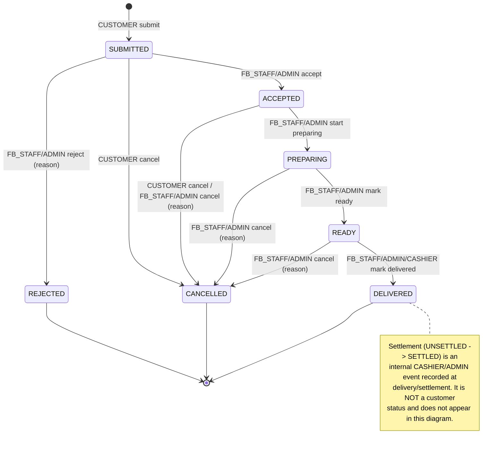

# F&B Order Lifecycle — State Model (Pod B Design)

## Status

| Field | Value |
|---|---|
| Document | FB_ORDER_LIFECYCLE_STATE_MODEL_v1.0.md |
| Project | Adeks Platform |
| Version | v1.0 |
| Owner | Pod B — Architecture, Logic & Risk |
| Reviewer / Approver | Kerem |
| Current status | **Accepted** — Kerem-approved as written 2026-06-13; R-1…R-4 confirmed as recommended. Still does **not** authorize Pod C. |
| Target repo path | `/docs/architecture/FB_ORDER_LIFECYCLE_STATE_MODEL_v1.0.md` |
| Supersedes | Nothing. Builds on `/docs/reviews/FB_ORDER_LIFECYCLE_REVIEW_v1.0.md` |
| Implementation status | **Does NOT authorize Pod C.** Financially- and security-sensitive design; requires Kerem approval (Kerem + Pod B gate for wallet/loyalty/payment logic per methodology §13). |
| Scope class | Narrow F&B lifecycle/state model only. Not a wallet ledger ADR, not a loyalty ledger ADR, not an API/schema spec. |

**Approval record:** Kerem approved this design note **as written on 2026-06-13** and confirmed the four Pod B design resolutions exactly as recommended: **R-1** staff cancel allowed from `ACCEPTED`/`PREPARING`/`READY`; **R-2** customer cancellation requires no reason; **R-3** `CASHIER` narrowed to mark-delivered + settlement; **R-4** combined status = single customer field with settlement kept internal. The G-1 governance gate is satisfied. Pod C remains blocked on the cross-domain dependencies below (D-1…D-4); approval of this note does **not** authorize Pod C.

**Verdict (full statement in §11–§12): NOT READY for Pod C issue drafting.** The lifecycle/state model itself is design-complete and internally consistent with Kerem's resolved F&B decisions. With G-1 now satisfied, Pod C remains blocked on cross-domain dependencies only (wallet ledger ADR-006, loyalty ledger ADR-007, loyalty earning formula, F&B item price source).

---

## 1. Review Scope and Source Freshness

### 1.1 Scope

This note formalizes the Phase 1 F&B order **lifecycle/state model**: the formal state list, the transition table (source → target, actor, trigger, pre/postconditions, audit), the per-actor authority table, the customer cancellation boundary and concurrency rule, staff rejection/cancellation rules and required reason fields, the combined order/payment display model, the wallet-debit settlement event, the loyalty-accrual append event, and reversal/correction implications.

**Out of scope (explicitly not designed here):** wallet ledger schema/entry taxonomy/balance derivation (ADR-006), loyalty ledger schema/entry taxonomy (ADR-007), loyalty earning formula/precision/rounding (BRD-LOY-002 / OQ-LOY-002), loyalty redemption/expiry/exclusions, wallet top-up methods and wallet correction policy (BRD-WAL-001/002), F&B item pricing, audit storage/tamper/retention schema (OQ-AUDIT-001), KVKK/legal questions, reservations, Selcafe, SMS, API contracts, database schema, migrations, and code. This note does not reopen any resolved Kerem F&B product decision and does not authorize Pod C.

### 1.2 Sources read

Read from the F&B product-control set provided for this task (treated as the current repo snapshot Kerem attached for this session):

| Source | Status / version as read | Use in this design |
|---|---|---|
| `docs/BUSINESS_RULES.md` | v0.2 decision-prep; BR-FB-001…011 recorded | Primary source of resolved F&B product decisions |
| `docs/MVP_SCOPE.md` | v0.3 F&B lifecycle reconciliation | Confirms F&B lifecycle implementation blocker and dependency set |
| `docs/OPEN_QUESTIONS.md` | v0.2; OQ-ORDER-001…004 marked resolved / do-not-reopen | Confirms resolved scope and remaining cross-domain blockers |
| `docs/reviews/FB_ORDER_LIFECYCLE_REVIEW_v1.0.md` | v1.0, "Safe with corrections" | Source of FB-001…FB-012 findings this note resolves |
| `docs/USER_ROLES_AND_PERMISSIONS.md` | v0.2, "Pod B review complete — ready for Kerem approval" | Source of actor authority (CASHIER/FB_STAFF/ADMIN order-status and payment boundaries) |
| `docs/PROJECT_METHODOLOGY.md` | v0.8 (per BUSINESS_RULES freshness baseline) | Review/approval gates, Definition of Ready, handoff routing |

### 1.3 Freshness caveat

Live `main` SHAs were not independently re-read in this session; the design is based on the attached snapshot. The attached snapshot is internally consistent across all six files on every F&B decision used here. **Per the repo-is-source-of-truth principle, `main` wins on any conflict.** Before commit, capture the current `main` SHA for each source file in this note's freshness baseline and re-verify that BR-FB-003…011 and OQ-ORDER-001…004 are unchanged. `USER_ROLES_AND_PERMISSIONS.md` is *ready for Kerem approval* (not yet Accepted); the actor authority in §4 inherits any change Kerem makes to that document at its approval.

### 1.4 Findings carried from the v1.0 review

| Review finding | Disposition in this design |
|---|---|
| FB-001 unavailable item → undefined state | **Resolved by Kerem** (BR-FB-007): full-order Rejected, customer submits new order. Formalized in T3 + §6. |
| FB-002 Ready/On the way one or two states | **Resolved by Kerem** (BUSINESS_RULES §"Customer-visible F&B order statuses", 2026-06-12): **one internal state, one customer-visible label.** Formalized as state `READY`. |
| FB-003 staff cancel scope ambiguous | **Pod B design resolution** (§6): staff cancel allowed from `ACCEPTED`, `PREPARING`, `READY`. `[CONFIRM — KEREM]` light-touch only. |
| FB-004 actor granularity for reject/cancel | **Pod B design resolution** (§4): `FB_STAFF` + `ADMIN`. `MANAGER` does not exist in Phase 1. |
| FB-005 customer-cancel source states + concurrency | **Pod B design resolution** (§5): source states `SUBMITTED`, `ACCEPTED`; `PREPARING` transition wins concurrently. |
| FB-006 wallet for F&B | **Resolved by Kerem** (BR-FB-010): cashier-mediated wallet debit at delivery/settlement; **no hold at submission.** Formalized as event S1 (§8). |
| FB-007 loyalty accrual | **Resolved by Kerem** (BR-FB-011): accrues on cashier-recorded settlement; cancelled/rejected never accrue. Formalized as event L1 (§9). |
| FB-008 combined status model | **Pod B design resolution** (§7). Self-pay exclusion confirmed by Kerem (no payment link/button/prompt/in-app flow). |
| FB-009 Delivered ≠ Paid | **Resolved by design** (§7): settlement is an internal state decoupled from the customer-facing `DELIVERED` status. |
| FB-010 audit reason is personal data (KVKK) | **Carried forward** to the audit/KVKK ADR work (out of scope here). Flagged in §6 and §11. |
| FB-011 Rejected wording | Pod A wording item; reflected in BUSINESS_RULES §"statuses" already. Not a Pod B deliverable. |
| FB-012 transitions are explicit actor events | **Adopted as design principle P-2** (§2.3). |

---

## 2. Formal State List

### 2.1 Lifecycle states (customer-facing)

The customer-facing lifecycle is exactly the seven Kerem-approved statuses (BR-FB-003). Each is **one internal state** (Ready/On the way confirmed single-state by Kerem).

| # | State | Kind | Meaning (product) | Entry condition | Exit condition |
|---|---|---|---|---|---|
| 1 | `SUBMITTED` | initial | Customer placed the order; staff has not accepted or rejected it. | Customer submits order. | Staff accepts, staff rejects, or customer cancels. |
| 2 | `ACCEPTED` | intermediate | Staff accepted the order. | Staff accepts from `SUBMITTED`. | Staff starts preparing, staff cancels, or customer cancels. |
| 3 | `PREPARING` | intermediate | Order is being prepared. **Customer cancellation is no longer possible.** | Staff starts preparing from `ACCEPTED`. | Staff marks ready, or staff cancels. |
| 4 | `READY` | intermediate | Ready for pickup / being brought to the customer (one state, displayed as "Ready / On the way"). | Staff marks ready from `PREPARING`. | Staff marks delivered, or staff cancels. |
| 5 | `DELIVERED` | **terminal** | Staff handed the order to the customer. **Does not imply payment settled** (see §7). | Staff marks delivered from `READY`. | — (terminal in Phase 1) |
| 6 | `REJECTED` | **terminal** | Staff rejected the order **before accepting it** (item unavailable or order invalid). | Staff rejects from `SUBMITTED` (mandatory reason). | — |
| 7 | `CANCELLED` | **terminal** | Order cancelled by customer before `PREPARING`, or by staff after acceptance with a required reason. | Customer cancel from `SUBMITTED`/`ACCEPTED`, or staff cancel from `ACCEPTED`/`PREPARING`/`READY` (mandatory reason). | — |

### 2.2 Internal settlement sub-state (not customer-facing)

Payment settlement is modelled as a **separate internal attribute** on the order, orthogonal to the fulfillment state machine above. It is **never a customer-facing status** and is visible only to `CASHIER`/`ADMIN`. This is what keeps the customer-facing status set equal to the seven approved labels while still supporting cashier-mediated wallet payment and loyalty accrual.

| Settlement state | Meaning | Set by |
|---|---|---|
| `UNSETTLED` | No F&B wallet debit recorded for this order yet. Default at submission. | (default) |
| `SETTLED` | Cashier/admin recorded the F&B wallet payment for this delivered order. | `CASHIER` / `ADMIN` (event S1, §8) |

There is **no hold/reserved settlement state** — confirmed by Kerem (BR-FB-010: no wallet hold at submission).

### 2.3 Design principles

- **P-1 (single source of customer truth):** the customer sees exactly one status field drawn from the seven labels; settlement is internal (§7).
- **P-2 (explicit transitions only):** every transition is an explicit actor-triggered event. No automatic/system-driven status change exists in Phase 1 unless a future ADR authorizes it (review FB-012). Item-unavailability is surfaced by an explicit staff action, not auto-detected.
- **P-3 (append-only, no overwrite):** all financial effects (wallet debit, loyalty accrual, and any future correction) are new ledger entries; no balance or prior entry is ever overwritten (BR-WALLET-004, BR-LOYALTY-005).
- **P-4 (terminal states are terminal):** `DELIVERED`, `REJECTED`, `CANCELLED` have no outbound transitions in Phase 1. Post-settlement financial correction is handled outside this state machine (§10).
- **P-5 (cashier-only payment):** no transition may be triggered by a payment/settlement event unless the actor is `CASHIER` or `ADMIN`; `FB_STAFF` never touches payment, wallet, or loyalty (BR-FB-002, BR-PAY-001).

### 2.4 State diagram (reference)

---

## 3. Transition Table

Audit semantics: "reason **required**" means a mandatory reason code/note that fails closed if absent. "transition logged" is the baseline status-change audit record (actor UUID, action, timestamp, order UUID) per BR-AUDIT-001; reason not required. All audit storage/tamper/retention mechanics are deferred to the audit ADR (OQ-AUDIT-001).

| ID | Source → Target | Triggering actor | Trigger event | Preconditions | Postconditions | Audit |
|---|---|---|---|---|---|---|
| **T1** | `[*]` → `SUBMITTED` | `CUSTOMER` (own) | Submit F&B order | Customer authenticated; order has ≥1 available item (catalog availability mechanism out of scope). | Order created in `SUBMITTED`; settlement `UNSETTLED`; **no wallet hold**; no loyalty. | Transition logged (order created). Reason: no. |
| **T2** | `SUBMITTED` → `ACCEPTED` | `FB_STAFF`, `ADMIN` | Accept order | Order `SUBMITTED`. | Order `ACCEPTED`. | Transition logged. Reason: no. |
| **T3** | `SUBMITTED` → `REJECTED` | `FB_STAFF`, `ADMIN` | Reject order (before acceptance) | Order `SUBMITTED`; cause is item-unavailable or order-invalid. | Order `REJECTED` (terminal); no settlement; no loyalty. Customer submits a new order (new T1). | **Reason REQUIRED** (`ITEM_UNAVAILABLE` / `ORDER_INVALID`). If item-unavailable: also an **item-level "marked unavailable" audit record** (item UUID + reason). |
| **T4** | `ACCEPTED` → `PREPARING` | `FB_STAFF`, `ADMIN` | Start preparing | Order `ACCEPTED`. | Order `PREPARING`; **customer cancellation now blocked**; this transition **wins** any concurrent customer cancel (§5). | Transition logged. Reason: no. |
| **T5** | `PREPARING` → `READY` | `FB_STAFF`, `ADMIN` | Mark ready / on the way | Order `PREPARING`. | Order `READY`. | Transition logged. Reason: no. |
| **T6** | `READY` → `DELIVERED` | `FB_STAFF`, `ADMIN`, `CASHIER` | Mark delivered | Order `READY`. | Order `DELIVERED` (fulfillment terminal); settlement **still `UNSETTLED`** (Delivered ≠ Paid). | Transition logged. Reason: no. |
| **T7** | `SUBMITTED`/`ACCEPTED` → `CANCELLED` | `CUSTOMER` (own) | Customer cancel | Order is the customer's own; status ∈ {`SUBMITTED`,`ACCEPTED`} (strictly **before** `PREPARING`). | Order `CANCELLED` (terminal); no settlement; no loyalty. | Transition logged (actor = customer). Reason: **not required** `[ASSUMPTION]` (see §6.4). |
| **T8** | `ACCEPTED`/`PREPARING`/`READY` → `CANCELLED` | `FB_STAFF`, `ADMIN` | Staff cancel (after acceptance) | Status ∈ {`ACCEPTED`,`PREPARING`,`READY`}; not `DELIVERED`/`REJECTED`/`CANCELLED`. | Order `CANCELLED` (terminal); no settlement; no loyalty (order is necessarily unsettled at this point). | **Reason REQUIRED** (`OPERATIONAL_OTHER` / `ITEM_UNAVAILABLE` / etc.). |
| **S1** | settlement `UNSETTLED` → `SETTLED` | `CASHIER`, `ADMIN` | Record F&B wallet payment / settlement | Order `DELIVERED`; settlement `UNSETTLED`; sufficient wallet balance (derivation via wallet ledger, out of scope); settlement amount from F&B price source (out of scope). | Settlement `SETTLED`; **one** append-only wallet entry `FB_SETTLEMENT_DEBIT` created (§8); triggers L1. | **Wallet/payment audit REQUIRED**: actor, timestamp, order UUID, customer UUID, amount, ledger-entry ref. |
| **L1** | (loyalty append, derived from S1) | `SYSTEM` on behalf of the S1 settlement actor | F&B loyalty accrual on settlement | S1 committed (order `SETTLED`); order not cancelled/rejected (guaranteed by S1 precondition); loyalty formula available (out of scope). | **One** append-only loyalty entry `FB_ACCRUAL` created (§9). | Loyalty audit logged: settlement actor (on whose action it derived), order ref, settlement ref, timestamp. |

**No other transitions exist.** Any event not in this table against a given state is rejected (fail-closed). In particular: no transition out of a terminal state; no `DELIVERED → *`; no settlement before `DELIVERED`; no second settlement on a `SETTLED` order (S1 is idempotent, §8).

---

## 4. Actor Authority Table

Phase 1 actors: `CUSTOMER`, `FB_STAFF`, `CASHIER`, `ADMIN`. `MANAGER` is a Phase 2 candidate and has no authority here. Authority below is consistent with `USER_ROLES_AND_PERMISSIONS.md` v0.2 (which grants `CASHIER`/`FB_STAFF`/`ADMIN` "Receive / update order status" and "Mark F&B order delivered", and restricts payment to `CASHIER`/`ADMIN`).

Legend: ✅ permitted · ❌ prohibited · — not applicable · ✅ own = own order only.

| Event / transition | `CUSTOMER` | `FB_STAFF` | `CASHIER` | `ADMIN` |
|---|:--:|:--:|:--:|:--:|
| Submit order (T1) | ✅ own | ❌ | ❌ | ❌ |
| Accept order (T2) | ❌ | ✅ | — `[*]` | ✅ |
| Reject order before acceptance (T3) | ❌ | ✅ | — `[*]` | ✅ |
| Start preparing (T4) | ❌ | ✅ | — `[*]` | ✅ |
| Mark ready / on the way (T5) | ❌ | ✅ | — `[*]` | ✅ |
| Mark delivered (T6) | ❌ | ✅ | ✅ | ✅ |
| Customer cancel (T7) | ✅ own | ❌ | ❌ | ✅ |
| Staff cancel with reason (T8) | ❌ | ✅ | — `[*]` | ✅ |
| Mark item unavailable (item-level, feeds T3) | ❌ | ✅ | — `[*]` | ✅ |
| Record F&B wallet settlement / debit (S1) | ❌ | ❌ | ✅ | ✅ |
| Loyalty accrual (L1) — system-derived from S1 | ❌ | ❌ | ❌ (derives from cashier action) | ❌ (derives from action) |
| View own order status (combined) | ✅ own | — | — | ✅ all |
| See/modify any payment or settlement state | ❌ | ❌ | ✅ | ✅ |

`[*]` **Pod B design resolution / `[CONFIRM — KEREM]` (light):** `USER_ROLES` grants `CASHIER` a general "update order status" capability, but in the F&B operating model the **fulfillment** transitions (Accept, Reject, Start preparing, Mark ready, Staff cancel) are **`FB_STAFF`-driven**, with `ADMIN` able to perform any transition under full operational oversight. `CASHIER`'s lifecycle-critical actions are **marking delivered** (T6, where delivery and cashier settlement coincide at the main point) and **settlement** (S1). The "—" entries above narrow `CASHIER` away from non-settlement fulfillment transitions to prevent over-authorization. If Kerem wants `CASHIER` to retain the broader order-status authority `USER_ROLES` grants verbatim, flag at approval and the "—" cells become ✅; nothing else in the model changes. **[Confirmed by Kerem 2026-06-13: narrowing approved as written — `CASHIER` is limited to mark-delivered (T6) + settlement (S1); the "—" cells stand.]** **`FB_STAFF` never settles, never accrues, never touches payment/wallet/loyalty** under any reading (P-5).

---

## 5. Customer Cancellation Boundary and Concurrency Rule

### 5.1 Boundary (Kerem-confirmed)

- **Allowed source states:** `SUBMITTED`, `ACCEPTED` only (BR-FB-004: cancellation allowed while Submitted or Accepted).
- **Blocked from:** `PREPARING`, `READY`, `DELIVERED`, `REJECTED`, `CANCELLED`. Once the order enters `PREPARING`, customer cancellation is permanently unavailable for that order.
- A blocked customer-cancel attempt returns a deterministic, non-error UX result ("This order is already being prepared and can no longer be cancelled"), not a server error.

### 5.2 Concurrency rule (the Preparing race)

The hazard (review FB-005): a customer cancel (T7) and a staff start-preparing (T4) arrive for the same order at nearly the same time.

**Rule:** customer cancellation is a **guarded, atomic, compare-and-set transition** — it may commit *only if* the order's current status is still `SUBMITTED` or `ACCEPTED` at the moment of commit. T4 (`ACCEPTED → PREPARING`) is likewise guarded on the current status. The two transitions cannot both succeed:

- If T4 commits first → the order is `PREPARING`; T7's guard fails → customer cancel is **rejected** with the "already being prepared" result. **The Preparing transition always wins.**
- If T7 commits first → the order is `CANCELLED`; T4's guard fails → staff's start-preparing is rejected with an "order was cancelled by the customer" result.

There is **no interleaving in which an order is both `CANCELLED` and `PREPARING`**, and no window in which a cancel lands after preparation has begun.

**Implementation note (deferred to Pod C/schema, mechanism not prescribed here):** the invariant must be enforced atomically — e.g., optimistic concurrency on a status/version field with a compare-and-set, or a short transactional row lock on the order during the status transition. This note specifies the **invariant** (mutually exclusive, Preparing-wins, no limbo state); the concrete mechanism is an ADR-006-adjacent/schema decision and is not designed here.

---

## 6. Staff Rejection / Cancellation Rules and Required Reason Fields

### 6.1 Rejection (T3) — before acceptance only

- Allowed **only** from `SUBMITTED` (BR-FB-005: "reject **before accepting**"). Rejection is not available once the order is `ACCEPTED` or later — past acceptance, the path is staff **cancellation** (T8).
- Causes: item unavailable, or order invalid.
- **Reason is mandatory** (fails closed). Item-unavailability rejections additionally produce an **item-level "marked unavailable" audit record** (BR-FB-007), distinct from the order-level rejection record.
- Outcome: full order `REJECTED`; customer submits a new order (no partial-order handling in Phase 1 — do-not-reopen, OQ-ORDER-003).

### 6.2 Staff cancellation (T8) — after acceptance, with reason

- **Pod B design resolution (FB-003):** allowed from `ACCEPTED`, `PREPARING`, and `READY` (the broad reading of "after acceptance" — staff must be able to abort an order that is already in preparation or ready, e.g., kitchen failure or customer left). Not allowed from `DELIVERED` (terminal; post-delivery issues are §10 ledger-domain) or from `SUBMITTED` (that is rejection, T3).
- **Reason is mandatory** (BR-FB-006, fails closed).
- `[CONFIRM — KEREM]` (light, non-blocking): if Kerem intends staff cancellation to be limited to `ACCEPTED` only (with a different governance path for `PREPARING`/`READY`), flag at approval; the source-state set narrows accordingly and nothing else changes. **[Confirmed by Kerem 2026-06-13: broad reading approved as written — staff cancel is permitted from `ACCEPTED`, `PREPARING`, and `READY`.]**

### 6.3 Required reason fields (minimum)

For both T3 and T8, the reason record carries at minimum:

| Field | Requirement |
|---|---|
| Reason code | Required. Minimum proposed set: `ITEM_UNAVAILABLE`, `ORDER_INVALID` (reject only), `OPERATIONAL_OTHER`. |
| Free-text note | Optional; required when code = `OPERATIONAL_OTHER` `[ASSUMPTION]`. |
| Actor UUID | Required. |
| Order UUID | Required. |
| Item UUID(s) | Required when code = `ITEM_UNAVAILABLE`. |
| Timestamp | Required. |

`[PRODUCT IMPLICATION — POD A ALIGNMENT NEEDED]` the exact reason-code enumeration and the customer-visible copy for rejection/cancellation are a small Pod A/UX item. This is **not** a blocking decision; Pod B's minimum set above is sufficient to design against.

### 6.4 Customer cancellation reason

`[ASSUMPTION]` per the v1.0 review: customer cancellation (T7) does **not** require a stated reason. If Kerem wants customer-cancel reasons captured (e.g., for service analytics), flag at approval and T7 gains an optional/structured reason field. Non-blocking. **[Confirmed by Kerem 2026-06-13: no customer-cancel reason required in Phase 1.]**

### 6.5 KVKK note (carried forward)

Rejection/cancellation reasons link to specific orders and customers and are personal data under KVKK (review FB-010). The reason store must be covered by the project's pseudonymization and retention strategy so that a right-to-erasure request leaves audit records resolvable without prohibited deletion. **Out of scope to resolve here**; routed to the audit/KVKK ADR work (§11).

---

## 7. Combined Order/Payment Display Model

BR-FB-008 routes the combined-status **model** to Pod B; Kerem confirmed cashier-only payment and **no self-pay UI** (no payment link, button, prompt, or in-app payment flow). Pod B's model:

### 7.1 Model (Pod B design resolution)

- **One customer-facing status field** ("the combined status"), whose values are exactly the seven approved labels (`Submitted`, `Accepted`, `Preparing`, `Ready / On the way`, `Delivered`, `Rejected`, `Cancelled`). The customer never sees two separate tracks (one fulfillment, one payment).
- **Settlement is internal.** The `UNSETTLED`/`SETTLED` sub-state (§2.2) is visible **only** to `CASHIER`/`ADMIN`. It is **not** rendered to the customer as a status, badge, "paid/unpaid" indicator, or anything else on the order view.
- **No payment interaction on the customer side.** The customer-facing component contains **no** payment button, link, prompt, amount-due CTA, or in-app payment flow (BR-FB-008 guardrail; cashier-only payment, P-5).
- **Where the customer learns of the charge:** through their **wallet balance/history** view (a separate feature, BR-WALLET-001), not through the order status. The order status answers "where is my food," the wallet view answers "what was I charged." Keeping these separate is what preserves cashier-only payment in the UI.

### 7.2 Why this satisfies the constraints

| Constraint | How the model satisfies it |
|---|---|
| "Combined" customer status (BR-FB-008) | Single unified status field — no separate customer-facing payment track. |
| Cashier-only payment (BR-PAY-001) | Settlement is set only by `CASHIER`/`ADMIN` via S1; never by customer or `FB_STAFF`. |
| `Delivered` ≠ `Paid` (FB-009) | `DELIVERED` is fulfillment-only; settlement is a decoupled internal state. A delivered order can be `UNSETTLED`. |
| No self-pay UI (Kerem) | No interactive payment element anywhere on the customer order view. |
| Seven-label vocabulary (BR-FB-003) | The combined status uses only those seven values; no "Paid"/"Completed" label is introduced. |

### 7.3 Alignment point

`[PRODUCT IMPLICATION — POD A ALIGNMENT NEEDED]` this model treats "combined" as *"a single unified customer status field"* rather than *"a customer-visible settlement indicator on the order."* If Kerem/Pod A intend the customer to see an explicit settlement indicator on the order view (e.g., a non-interactive "Delivered · settled" marker), that is a **small additive change** — but it must remain (i) non-interactive, (ii) updatable only by `CASHIER`/`ADMIN` via S1, and (iii) free of any payment CTA. Pod B recommends the wallet-view approach in §7.1 as the simpler, lower-risk Phase 1 default. Non-blocking; confirm at approval. **[Confirmed by Kerem 2026-06-13: §7.1 model approved as written — single customer status field, settlement kept internal, no customer-facing settlement indicator.]**

---

## 8. Wallet Debit (Settlement) Event Design

*This designs the lifecycle-facing settlement **event** only. The wallet ledger itself — entry taxonomy, balance derivation, concurrency, partial-failure handling, storage — is ADR-006 and is **not** designed here.*

### 8.1 Event S1 — `FB_SETTLEMENT_DEBIT`

| Aspect | Specification |
|---|---|
| Trigger | `CASHIER`/`ADMIN` records the F&B wallet payment for a delivered order (BR-FB-010: "debit recorded by CASHIER/ADMIN at the time of delivery/settlement"). |
| Model | **Debit-at-delivery only.** **No hold at submission** (BR-FB-010). This is the review's Scenario B1 (low-medium risk), not the hold-and-settle B2 model. |
| Preconditions | Order `DELIVERED`; settlement `UNSETTLED`; wallet balance sufficient for the settlement amount (balance derivation via ADR-006, out of scope); settlement amount sourced from F&B item price (out of scope source). |
| Postconditions | Settlement → `SETTLED`; **one** append-only wallet ledger entry of type `FB_SETTLEMENT_DEBIT` created referencing the order; loyalty accrual L1 triggered. |
| Append-only | No balance overwrite; the debit is a new immutable ledger entry (P-3, BR-WALLET-004). |
| Idempotency | Exactly **one** settlement debit per order. A second S1 against a `SETTLED` order is rejected. (Mechanism — unique constraint on (order, entry-type) or equivalent — is an ADR-006/schema detail, not designed here.) |
| Conceptual entry fields | order UUID, customer UUID, entry type `FB_SETTLEMENT_DEBIT`, amount, actor UUID (cashier/admin), timestamp, audit ref. *(Indicative only; authoritative entry schema is ADR-006.)* |
| Never settles | Orders in `SUBMITTED`/`ACCEPTED`/`PREPARING`/`READY`/`REJECTED`/`CANCELLED` are never debited. Only `DELIVERED` + `UNSETTLED` orders are eligible. |

### 8.2 Explicitly deferred to ADR-006 (wallet ledger)

Entry-type taxonomy beyond this one event, balance derivation, concurrency/locking on the wallet, insufficient-balance handling policy, settlement-amount disputes, and partial-failure/rollback semantics. The settlement amount's **price source** (F&B item pricing) is a separate dependency (§11).

---

## 9. Loyalty Accrual (Settlement) Append-Event Design

*This designs the accrual **event** only. The loyalty ledger (entry taxonomy, balance derivation) is ADR-007, and the earning **formula** is BRD-LOY-002 / OQ-LOY-002 — neither is designed or resolved here.*

### 9.1 Event L1 — `FB_ACCRUAL`

| Aspect | Specification |
|---|---|
| Trigger | **Derived from S1.** Accrual fires when, and only when, the cashier-recorded wallet payment/settlement (S1) is committed (BR-FB-011: trigger = CASHIER records wallet payment/settlement). |
| Not on Delivered alone | `DELIVERED` does **not** accrue. Accrual is bound to settlement (S1), preserving the Delivered≠Paid separation (FB-009). |
| Preconditions | S1 committed (order `SETTLED`); order not cancelled/rejected (guaranteed — those never reach S1); loyalty earning formula available (out of scope). |
| Postconditions | **One** append-only loyalty ledger entry of type `FB_ACCRUAL` created, referencing the order and the settlement entry. |
| Amount | `points = f(order, formula)` where `f` is the Phase 1 loyalty earning formula — **deferred** (BRD-LOY-002). Precision/rounding are Pod B ledger concerns under ADR-007, also deferred. |
| Append-only / once | Exactly one accrual per settled order; no overwrite (P-3, BR-LOYALTY-005). |
| Exclusions | `CANCELLED` and `REJECTED` orders **never** accrue (BR-FB-011) — structurally guaranteed because they never reach S1. |
| Conceptual entry fields | order UUID, customer UUID, entry type `FB_ACCRUAL`, points amount (formula-derived), settlement-entry ref, timestamp, audit ref. *(Indicative only; authoritative schema is ADR-007.)* |

### 9.2 Explicitly deferred

Loyalty earning formula, precision/rounding, eligibility beyond F&B, redemption, expiry, exclusions taxonomy, and reversal of accrual on post-settlement correction (§10). These are BRD-LOY-001…008 / OQ-LOY-001…005 and ADR-007.

---

## 10. Reversal / Correction Implications

### 10.1 Cancelled / rejected (pre-settlement) — clean, nothing to reverse

`CANCELLED` (T7/T8) and `REJECTED` (T3) all occur **strictly before** any settlement. By design, an order in these states has produced **no** wallet `FB_SETTLEMENT_DEBIT` and **no** loyalty `FB_ACCRUAL`. Therefore there is **no financial entry to reverse** — the absence of a debit/accrual is the "reversal." This is the principal safety benefit of the debit-at-delivery (no-hold) model: pre-delivery termination carries zero financial-reversal requirement (review Scenario B1, low risk).

### 10.2 Settled orders (post-settlement) — out of lifecycle scope, dependency-gated

Once an order is `DELIVERED` + `SETTLED`, the Phase 1 lifecycle provides **no** un-deliver and **no** un-settle transition (P-4). If a settled order later needs correction (wrong amount, post-delivery dispute, returned item), the correction is **not** a state-machine operation. It must be a **compensating append entry** in the wallet ledger (e.g., a reversal/credit entry) plus a **compensating loyalty reversal** entry — never an overwrite of a balance or prior entry (P-3).

The **policy** governing such corrections (who may initiate/execute, required reason, customer visibility) is:

- Wallet correction/reversal: **BRD-WAL-002 / OQ-WAL-002** — *deferred, blocks Pod C, out of scope here.*
- Loyalty earning exclusions / reversal of cancelled/refunded earning: **BRD-LOY-003 / OQ-LOY-003** — *deferred, blocks Pod C, out of scope here.*

**Disposition:** this note does **not** resolve post-settlement correction and does **not** introduce a new Kerem decision for it — those decisions already exist as BRD-WAL-002 and BRD-LOY-003. This note records the **boundary** (the lifecycle stops at the terminal states; corrections live in the ledger/correction domain) and the **dependency** (the full F&B reversal surface cannot be issue-drafted until those policies and ADR-006/007 land). The happy path and pre-settlement cancellation/rejection are fully designed and unaffected by that gap.

### 10.3 Append-only invariant (restated)

No order state and no balance is ever mutated in place. Every financial effect — debit, accrual, and any future correction — is a new immutable entry. This holds across all of §8, §9, and §10 (P-3).

---

## 11. Remaining Blockers Before Pod C Issue Drafting

### 11.1 Governance gate (in scope of this note)

| Gate | Detail |
|---|---|
| **G-1 — Kerem approval of this design note** | This is a financially- and security-sensitive architectural design (wallet debit + loyalty accrual events; audit points; actor authority). Methodology requires an **approved** state machine before Pod C (§16 Pod B→Pod C handoff) and a **Kerem + Pod B** gate for wallet/loyalty/payment logic (§13). Pod B review does not replace Kerem approval (§7). This note seeks that approval. **No Pod Impact Matrix / Instruction Update Packet is required** — this is a domain design artifact, not a change to pod behavior, methodology, gates, or platform instructions. |

### 11.2 Cross-domain dependencies (out of scope here; must land before/with Pod C F&B issues)

| Dependency | Why it blocks F&B implementation | Source |
|---|---|---|
| **D-1 — Wallet ledger design (ADR-006)** | `FB_SETTLEMENT_DEBIT` (S1) must land in a defined append-only wallet ledger (entry taxonomy, balance derivation, concurrency). ADR-006 is currently **stub** (direction locked). | MVP_SCOPE §"Wallet/loyalty ledgers"; methodology §19 ADR-006 stub |
| **D-2 — Loyalty ledger design (ADR-007)** | `FB_ACCRUAL` (L1) must land in a defined append-only loyalty ledger. ADR-007 is currently **stub**. | MVP_SCOPE; methodology §19 ADR-007 stub |
| **D-3 — Loyalty earning formula** | The accrual **amount** in L1 cannot be computed without the Phase 1 formula. | BRD-LOY-002 / OQ-LOY-002 (blocks Pod C) |
| **D-4 — F&B item price source** | The settlement **amount** in S1 needs a defined F&B item price source. `[ASSUMPTION]` no Phase 1 F&B pricing rule is yet recorded in the reviewed set; if it exists elsewhere, link it; if not, it is a dependency. | (not found in reviewed docs) |
| **D-5 — Wallet correction policy + loyalty exclusions** | Required only for the **post-settlement correction** surface (§10.2), not the happy path. Blocks the *complete* F&B reversal issue set. | BRD-WAL-002 / OQ-WAL-002; BRD-LOY-003 / OQ-LOY-003 |
| **D-6 — Audit event schema + KVKK pseudonymization** | The mandatory reason/audit fields (T3/T8/S1) need the audit event schema (storage, tamper, retention) and the reason store covered by pseudonymization/retention. Build on the Accepted auth threat-model baseline. | OQ-AUDIT-001; review FB-010 |

### 11.3 Non-blocking alignment items

| Item | Owner | Note |
|---|---|---|
| A-1 | Pod A / UX | Customer combined-status component renders only the seven labels, no payment element (§7). |
| A-2 | Pod A / UX | Rejection/cancellation reason-code enumeration and customer-visible copy (§6.3). |
| A-3 | Kerem (light) | Confirm or correct the four Pod B design resolutions in §12.3. |

### 11.4 Sequencing note (option, not a recommendation to act)

The **pure-fulfillment slice** (T1–T8, no S1/L1) depends only on G-1 + D-6, not on D-1…D-5. If Kerem chooses to sequence fulfillment ahead of settlement/loyalty, that slice could reach Definition of Ready earlier, with settlement/accrual added once D-1…D-4 land. This is an option for Kerem/Pod A to consider; this note does not assume it and does not authorize it.

---

## 12. Review Routing and Approval Requirements

### 12.1 Routing

| Question | Answer |
|---|---|
| Ready for commit? | Yes — as a Pod B design artifact under `/docs/architecture/`, after Kerem approval. Documentation/design class. |
| Requires Kerem approval? | **Yes** — financially- and security-sensitive design (wallet debit + loyalty accrual events, audit points, actor authority). Kerem + Pod B gate. |
| Requires further Pod B work? | Yes, but as **separate** deliverables: ADR-006 (wallet ledger), ADR-007 (loyalty ledger), audit event schema, KVKK pseudonymization for the reason/audit store. None of those are this note. |
| Requires Pod C implementation? | **No.** This note does **not** authorize Pod C and must not be used to issue implementation work. |
| Requires Pod D? | Optional, later — customer combined-status and staff reject/cancel UX validation. |
| Pod Impact Matrix / Instruction Update Packet? | **No** — domain design artifact; not a change to pod behavior, methodology, gates, context-loading, output rules, or platform instructions. |

### 12.2 Verdict

**NOT READY for Pod C issue drafting.**

- The F&B lifecycle/**state model** (states, transitions, actor authority, audit points, cancellation boundary, concurrency rule, combined-display model, settlement and accrual event shapes, reversal boundary) is **design-complete** and **internally consistent** with Kerem's resolved F&B decisions (BR-FB-003…011; OQ-ORDER-001…004). It closes the **Pod B lifecycle-formalization** portion of the F&B implementation blocker (MVP_SCOPE §"Blocked Items").
- Pod C is **still blocked** by: **G-1** (Kerem approval of this note) and the cross-domain dependencies **D-1…D-4** (wallet ledger ADR-006, loyalty ledger ADR-007, loyalty formula, F&B price source), with **D-5/D-6** required for the complete reversal/audit surface.
- Pod C becomes draftable for the **full** F&B feature once G-1 + D-1…D-4 (+ D-6) are satisfied; the pure-fulfillment slice could be sequenced earlier if Kerem elects (§11.4).

### 12.3 Remaining Kerem-only decisions

**No new blocking F&B product decision is required.** Kerem has already resolved the F&B lifecycle product decisions (OQ-ORDER-001…004; BR-FB-003…011), and this note does not reopen them.

**Status — resolved 2026-06-13:**

1. **G-1 — design note approval: GRANTED.** Kerem approved as written; Pod B's F&B lifecycle formalization is Accepted.
2. **Four Pod B design resolutions: CONFIRMED as recommended.**
   - **R-1 (§6.2):** staff cancellation allowed from `ACCEPTED`, `PREPARING`, `READY` (broad reading). ✅ confirmed.
   - **R-2 (§6.4):** customer cancellation requires **no** reason. ✅ confirmed.
   - **R-3 (§4):** `CASHIER` narrowed to **mark-delivered + settlement**. ✅ confirmed.
   - **R-4 (§7.3):** "combined status" = single customer status field with settlement kept internal. ✅ confirmed.

Items D-1…D-6 are **not** new decisions — they are previously-tracked dependencies (ADRs and existing BRD/OQ items) surfaced here for sequencing. They remain open and continue to block Pod C.

---

*Produced by Pod B — Architecture, Logic & Risk. This is a state-model design note. It does not authorize Pod C, does not select a wallet/loyalty ledger design, does not set the loyalty formula, and does not resolve KVKK/audit-storage questions. The repository is the source of truth; verify `main` SHAs of the cited sources before commit.*
